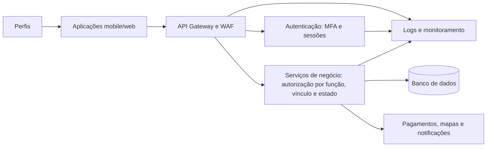

# Etapa 3 — Projeto de uma Arquitetura Segura

Esta etapa deriva requisitos e decisões de arquitetura da [Etapa 2](Análise%20e%20priorização%20de%20riscos.md). Foram selecionados R09, R07 e R01: indisponibilidade da API, exposição de localização e uso indevido de conta.

## 1. Requisitos de segurança

| ID | Risco de origem | Requisito de segurança | Critério de verificação |
| --- | --- | --- | --- |
| RS01 | R09 — Indisponibilidade da API | A API deverá limitar requisições por origem e rota nos endpoints públicos, rejeitando tráfego acima do limite configurado e gerando alerta de capacidade. | Em teste de carga autorizado, o excesso recebe resposta HTTP 429 e pedidos já aceitos continuam disponíveis. |
| RS02 | R07 — Exposição de endereço, telefone ou localização | A API deverá retornar endereço, telefone ou localização somente ao perfil autorizado e vinculado a pedido ativo; a localização deixará de ser disponibilizada após a entrega. | Consulta sem vínculo recebe resposta HTTP 403 ou recurso inexistente; teste pós-entrega não retorna localização e registra o acesso. |
| RS03 | R01 — Uso indevido de conta | O sistema deverá exigir MFA no acesso administrativo e nova autenticação antes de alterar dados bancários, senha, endereço ou confirmar reembolso. | Sem segundo fator ou nova autenticação válidos, a operação é recusada; quando válida, é concluída e registrada. |

## 2. Vulnerabilidades catalogadas

| Risco | Vulnerabilidade ou categoria | Referência utilizada | Relação com o sistema |
| --- | --- | --- | --- |
| R09 | CWE-770 — Allocation of Resources Without Limits or Throttling | [CWE-770](https://cwe.mitre.org/data/definitions/770.html); [OWASP Denial of Service Cheat Sheet](https://cheatsheetseries.owasp.org/cheatsheets/Denial_of_Service_Cheat_Sheet.html) | Sem limitação de recursos e requisições, tráfego abusivo pode esgotar a API e interromper pedidos e entregas. |
| R07 | CWE-639 — Authorization Bypass Through User-Controlled Key | [CWE-639](https://cwe.mitre.org/data/definitions/639.html); [OWASP Authorization Cheat Sheet](https://cheatsheetseries.owasp.org/cheatsheets/Authorization_Cheat_Sheet.html) | Um identificador de pedido manipulado pode expor dados de terceiros se a API não validar vínculo e permissão. |
| R01 | CWE-287 — Improper Authentication | [CWE-287](https://cwe.mitre.org/data/definitions/287.html); [OWASP Authentication Cheat Sheet](https://cheatsheetseries.owasp.org/cheatsheets/Authentication_Cheat_Sheet.html) | Falta de MFA ou de reautenticação em ação crítica facilita o uso de conta comprometida. |

## 3. Arquitetura segura proposta

O [arquivo-fonte Mermaid](../diagramas/etapa-3/arquitetura-segura.mmd) está versionado. A arquitetura posiciona limitação de requisições e monitoramento na borda; MFA e revogação de sessão na autenticação; autorização por função, vínculo com pedido e estado da operação no back-end; e logs centralizados para auditoria.

## 4. Decisões de arquitetura

| ID | Problema ou risco tratado | Decisão tomada | Componente afetado | Resultado esperado |
| --- | --- | --- | --- | --- |
| DA01 | R09 — Sobrecarga da API | Posicionar API gateway/WAF antes do back-end, com limite por rota/origem, alertas de latência e capacidade. | Borda da API e infraestrutura. | Tráfego abusivo é limitado antes de consumir os serviços de pedido. |
| DA02 | R07 — Exposição de dados de entrega | Centralizar no serviço de pedidos a autorização por função, vínculo com pedido ativo e estado da entrega; expirar localização após conclusão. | API de pedidos/entrega e banco de dados. | Apenas participantes necessários recebem dados pessoais durante o período necessário. |
| DA03 | R01 — Uso indevido de conta | Usar autenticação centralizada com MFA administrativo, reautenticação em ações sensíveis, expiração/revogação de sessão e logs de acesso. | Serviço de autenticação, contas e painel administrativo. | Senha ou sessão comprometida isoladamente não permite ação crítica; eventos podem ser investigados. |

## 5. Próxima conexão

A Etapa 4 deverá implementar ou apresentar pseudocódigo e testes para RS02 e RS03. Os testes de segurança devem ser escritos antes do código.
