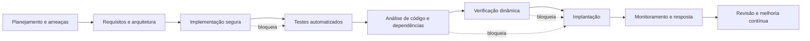

# Etapa 7 — DevSecOps e Vídeo Final

## 1. Objetivo

Esta etapa integra as decisões anteriores do projeto para demonstrar como a segurança pode acompanhar o ciclo de desenvolvimento do sistema **Entrega Fácil**. O objetivo não é implementar um pipeline completo em produção, mas apresentar uma visão coerente de como os riscos, requisitos, arquitetura, código seguro, testes e monitoramento devem funcionar em conjunto.

A proposta abaixo mantém a mesma arquitetura conceitual do projeto e conecta todas as etapas anteriores:

- Etapa 1: ameaças STRIDE e casos de abuso;
- Etapa 2: riscos e priorização com NIST CSF;
- Etapa 3: arquitetura segura;
- Etapa 4: práticas de código seguro e testes;
- Etapa 5: verificação de vulnerabilidades;
- Etapa 6: monitoramento e detecção.

---

## 2. Pipeline DevSecOps proposto

O pipeline abaixo representa uma implementação simples, porém realista, para o Entrega Fácil.

| Momento | Atividade de segurança | Evidência produzida | Condição para continuar |
| --- | --- | --- | --- |
| Planejamento | Análise de ameaças STRIDE, riscos e priorização com NIST | Tabela de ameaças e riscos | Riscos críticos e altos identificados e aprovados |
| Requisitos e arquitetura | Definição de requisitos e decisões de arquitetura | Requisitos RS01–RS03 e decisões DA01–DA03 | Requisitos verificáveis e arquitetura coerente |
| Implementação | Práticas seguras e padrões de desenvolvimento | Pseudocódigo, revisão de código e controles | Código compatível com políticas de segurança |
| Testes automatizados | Testes unitários, de integração e testes de segurança | Casos de teste e relatórios | Testes de autorização e autenticação aprovados |
| Análise de código e dependências | Leitura de código, análise estática e verificação de dependências | Relatórios de vulnerabilidades e bibliotecas | Nenhuma dependência crítica não tratada |
| Verificação dinâmica | Varredura com ZAP ou ferramenta equivalente | Relatório de alertas | Achados críticos corrigidos ou formalmente tratados e aprovados pelo responsável pelo risco |
| Implantação | Deploy controlado, ambiente de homologação e validação | Checklist de implantação | Sem segredo exposto e sem falha crítica de acesso |
| Monitoramento e resposta | Logs, alertas, detecção e resposta a incidentes | Regras de detecção e registros de auditoria | Incidentes classificados e tratados |

### Condições que impediriam a continuidade do pipeline

As seguintes condições devem bloquear o avanço do pipeline:

1. Teste de segurança reprovado por uma falha crítica, como autorização sem validação, autenticação fraca ou exposição de dados sensíveis.
2. Vulnerabilidade crítica não analisada, com risco de exploração em produção.
3. Segredo encontrado no repositório, como chave de API, token, senha ou credencial em arquivo versionado.
4. Dependência conhecida como vulnerável, sem correção ou compensação explícita.
5. Falha no controle de acesso para funções administrativas ou dados sensíveis.
6. Ausência de evidência de verificação ou de logs relevantes para operação segura.

### Representação simples do pipeline

---

## 3. Relação entre as etapas e o pipeline

O DevSecOps proposto deve reforçar a continuidade do trabalho ao longo do ciclo:

- A análise de ameaças da Etapa 1 gera os requisitos e os riscos da Etapa 2.
- A arquitetura da Etapa 3 transforma esses riscos em decisões concretas.
- A implementação segura da Etapa 4 define como as decisões são convertidas em práticas operacionais.
- A verificação da Etapa 5 valida se o sistema ainda apresenta falhas relevantes.
- O monitoramento da Etapa 6 mostra como responder a atividades suspeitas em operação.
- A Etapa 7 reúne tudo isso em um fluxo contínuo de desenvolvimento, validação e operação.

Esse encadeamento é importante porque segurança não é um evento isolado; ela precisa ser incorporada em todo o ciclo de vida do software.

---

## 4. Roteiro do vídeo final

O vídeo final deve ter entre 5 e 8 minutos e apresentar a evolução do projeto de forma clara e objetiva.

### Estrutura sugerida

| Tempo | Conteúdo | Objetivo |
| --- | --- | --- |
| 00:00–00:45 | Abertura e apresentação do sistema | Apresentar o Entrega Fácil e o que ele faz |
| 00:45–01:45 | Principais ameaças e casos de abuso | Mostrar os problemas de segurança identificados |
| 01:45–02:45 | Riscos prioritários e critérios da Etapa 2 | Explicar os riscos mais graves e a priorização |
| 02:45–03:30 | Arquitetura segura e requisitos | Mostrar como a solução foi organizada |
| 03:30–04:30 | Práticas de código seguro e testes | Explicar as duas práticas implementadas conceitualmente |
| 04:30–05:15 | Resultado da verificação | Apresentar os alertas e correções propostas |
| 05:15–06:00 | Monitoramento e detecção | Explicar as regras de alerta e resposta |
| 06:00–06:45 | Pipeline DevSecOps | Mostrar a visão contínua da segurança |
| 06:45–07:30 | Aprendizados e fechamento | Destacar o que foi aprendido e as lições da disciplina |

### Roteiro em formato de fala

#### 1. Introdução
“Este projeto analisou a segurança de um sistema de delivery chamado Entrega Fácil. O objetivo foi identificar ameaças, transformar esses riscos em ações, propor arquitetura segura e demonstrar como cada etapa da disciplina contribui para uma operação mais segura.”

#### 2. Sistema e ameaças
“O sistema conecta clientes, restaurantes, entregadores e administradores. Ele trata pedidos, pagamentos, localização, mensagens e dados administrativos. Por isso, os principais problemas de segurança são acesso indevido, exposição de localização, manipulação de pedidos e indisponibilidade da API.”

#### 3. Riscos prioritários
“Entre os riscos, destacamos a indisponibilidade da API, a exposição de dados sensíveis e o uso indevido de conta. A partir da priorização, decidimos focar em controles de autorização, autenticação reforçada, monitoramento e logs confiáveis.”

#### 4. Arquitetura segura
“Como resposta, a arquitetura do sistema foi organizada com borda da API, autenticação centralizada, autorização no servidor, logs e separação de funções. Isso reduz riscos antes mesmo da implementação do código.”

#### 5. Código seguro
“Na prática, mostramos duas medidas essenciais: autorização por vínculo com pedido ativo e reautenticação para operações sensíveis. Os testes foram definidos antes da implementação e verificam cenários válidos e não autorizados.”

#### 6. Verificação e vulnerabilidades
“Também realizamos uma verificação com ZAP em um ambiente controlado. O objetivo foi observar alertas relevantes, interpretar os achados e propor correções. Isso reforça a importância da validação real e não apenas da análise teórica.”

#### 7. Monitoramento
“Depois da implantação, a operação deve registrar acessos, autenticações, falhas e alterações sensíveis. Regras de detecção ajudam a identificar força bruta, sobrecarga de API e consultas indevidas a dados de entrega.”

#### 8. DevSecOps
“Em conjunto, o pipeline de segurança conecta planejamento, arquitetura, implementação, testes, verificação, implantação e monitoramento. A ideia é que falhas críticas bloqueiem o avanço do projeto e que a segurança acompanhe a entrega contínua.”

#### 9. Fechamento
“Na prática, aprendemos que segurança precisa começar antes da implementação e continuar durante a operação. O sucesso do sistema depende da combinação de políticas, arquitetura, código seguro, testes e resposta a incidentes.”

---

## 5. Participação dos integrantes no vídeo

| Integrante | Trecho principal | Tempo aproximado |
| --- | --- | --- |
| Ismael Hister Oliveira | Abertura, sistema, ameaças e casos de abuso | 00:00–01:45 |
| Davi Tito Tafernaberry | Riscos prioritários, requisitos, arquitetura e código seguro | 01:45–04:30 |
| Ezequiel dos Santos Pereira | Ambiente autorizado, execução do ZAP e três achados selecionados | 04:30–05:15 |
| Luis Francisco Brum Gomes | Detecção, resposta, pipeline DevSecOps, aprendizados e fechamento | 05:15–07:30 |

A divisão pode ser ajustada durante a gravação, mas todos devem aparecer ou narrar uma parte identificável. A contribuição permanece compatível com o histórico de commits e com as tarefas executadas ao longo do projeto.

### Publicação do vídeo

Após a gravação, o grupo deve publicar o vídeo em local acessível ao professor e substituir o marcador correspondente no `README.md` pelo endereço final. Antes da entrega, o link deve ser testado em uma janela anônima para confirmar que não depende da conta de um integrante.

---

## 6. Considerações finais

A Etapa 7 consolida o trabalho da disciplina e mostra que a segurança deve ser tratada como parte do ciclo de desenvolvimento, e não como uma etapa isolada ao final. O Entrega Fácil foi analisado com base em ameaças reais, riscos priorizados, arquitetura segura, testes de segurança, monitoramento e resposta a eventos.

A proposta de DevSecOps apresentada é simples, porém coerente com o nível do trabalho acadêmico. Ela demonstra que, mesmo sem implementar um pipeline completo, é possível mostrar uma visão realista de como a segurança pode acompanhar continuamente o software.

Essa etapa fecha o ciclo da disciplina ao conectar análise, decisão, implementação, verificação e operação.
